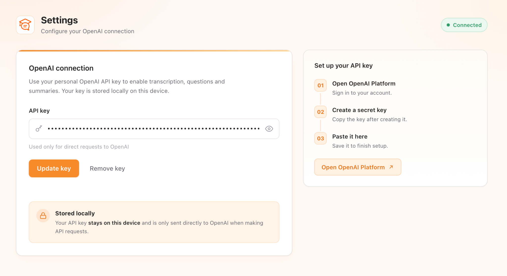
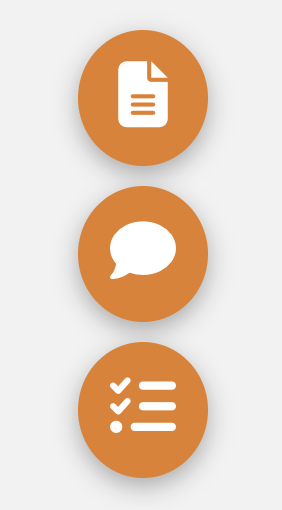
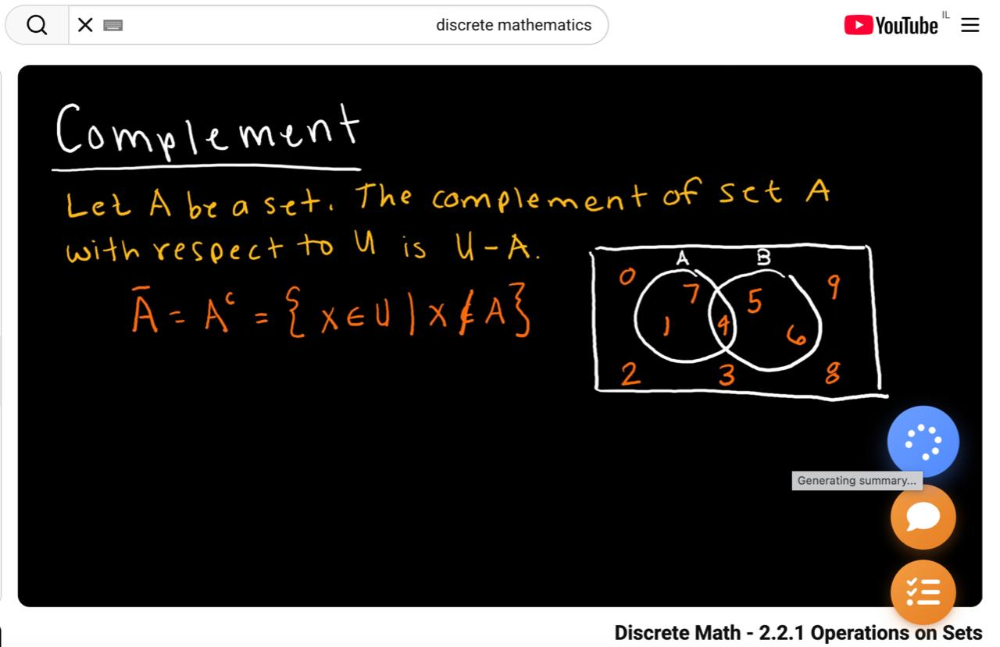
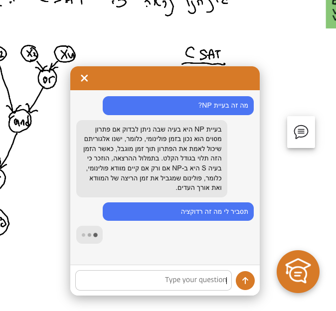
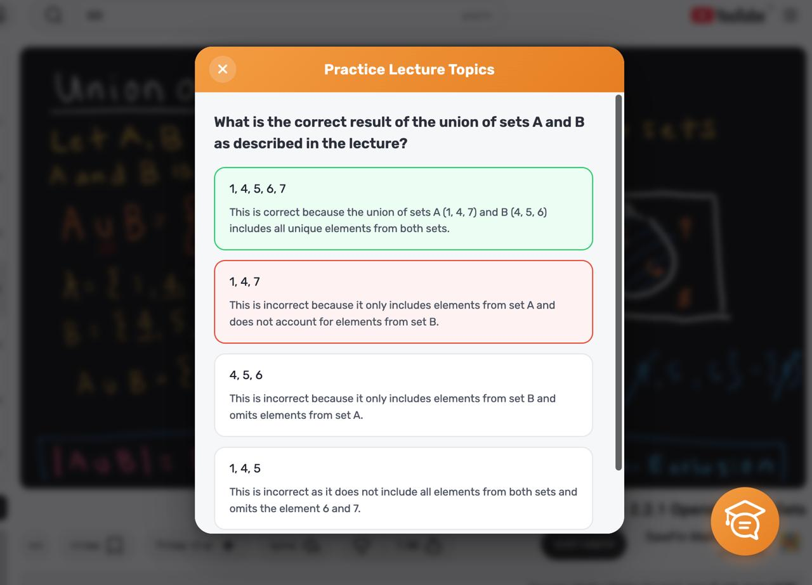

  

# AI Lecture Assistant

AI Lecture Assistant is a Chrome extension designed to help students study recorded lectures more efficiently.

It captures lecture audio while the user watches a recorded video, builds a transcript, and uses the lecture content to support review and practice.

The extension provides tools for generating printable lecture summaries, asking questions based on the active transcript, and practicing lecture topics with immediate feedback.

> This repository is a project showcase only. The source code is kept private.

## Features

* Printable lecture summary generation
* AI chat based on the active lecture transcript
* Topic-based practice questions with feedback and explanations

## Configuration

The extension settings page allows users to add, update, or remove their personal OpenAI API key. The key is stored locally in Chrome extension storage and is used for direct requests to OpenAI.

## Screenshots

### Main Extension Button

The extension adds a floating button to the lecture page, allowing the user to access the study tools while watching the lecture.

### Study Tools Menu

The extension provides quick access to lecture summaries, lecture-based AI chat, and practice questions.

### Summary Generation

The extension generates a formatted lecture summary that can be printed or saved as a PDF.

### Lecture-Based AI Chat

The chat interface allows students to ask questions based on the accumulated transcript of the active lecture.

### Practice Questions

The practice interface generates questions from lecture topics and provides immediate feedback with explanations.

## Tech Stack

* TypeScript
* Chrome `tabCapture`
* Offscreen Documents
* Web Audio API
* Node.js
* Express.js
* WebSocket
* OpenAI API

## Architecture

The project is divided into two main parts:

* **Chrome Extension** - Provides the user interface, coordinates tab-audio capture, manages lecture sessions, and generates transcript-based study tools.
* **Node.js Server** - Handles audio transcription and streams transcript updates back to the extension through WebSocket.

The codebase is organized into modular components for content scripts, background logic, offscreen audio processing, transcript storage, and AI-powered learning features.
